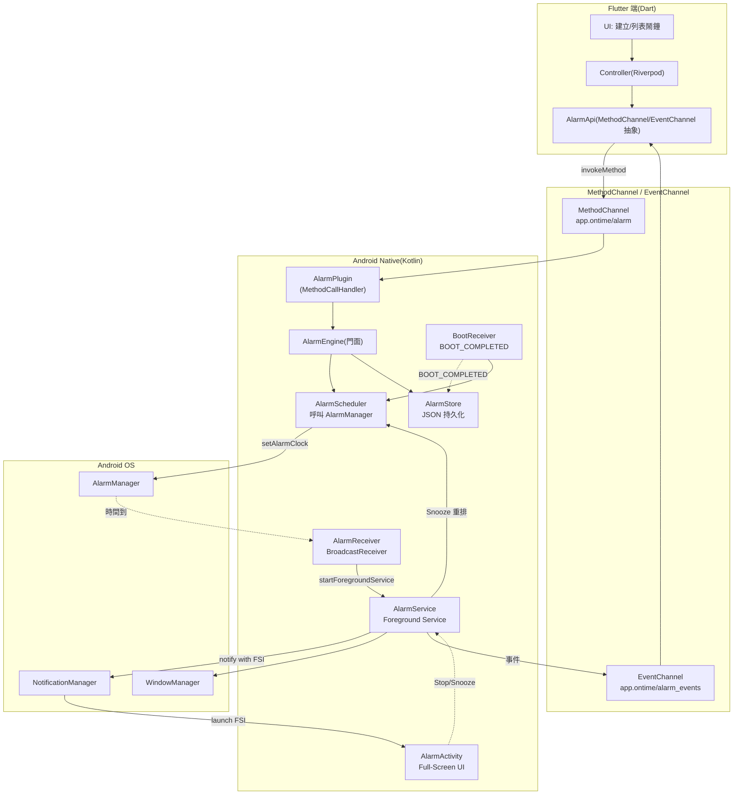
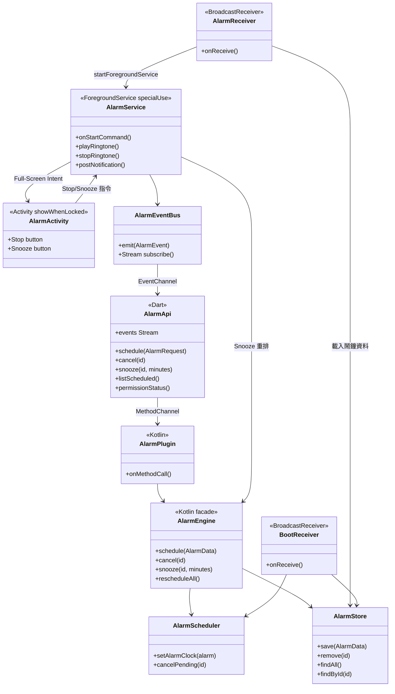
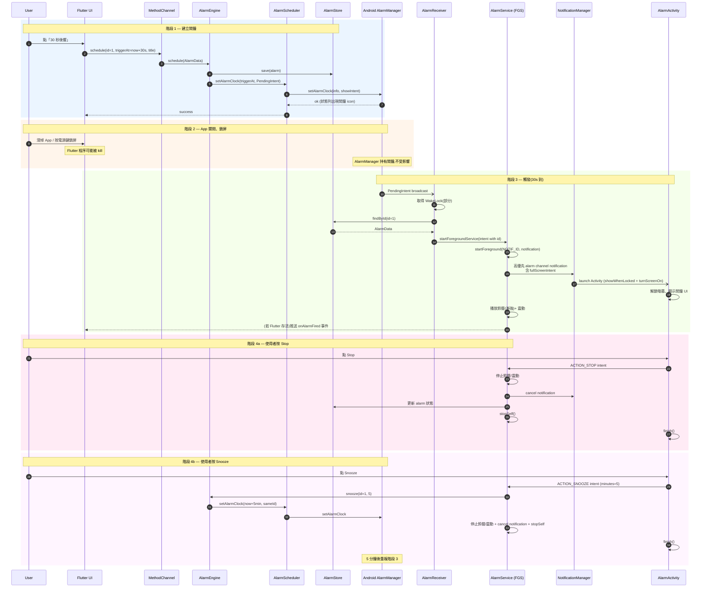
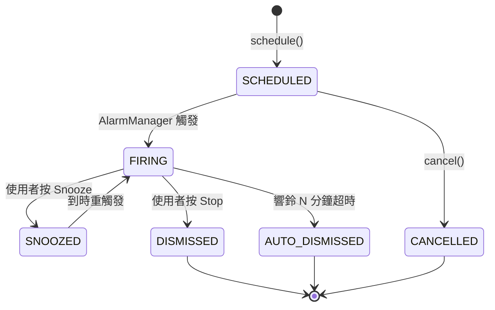
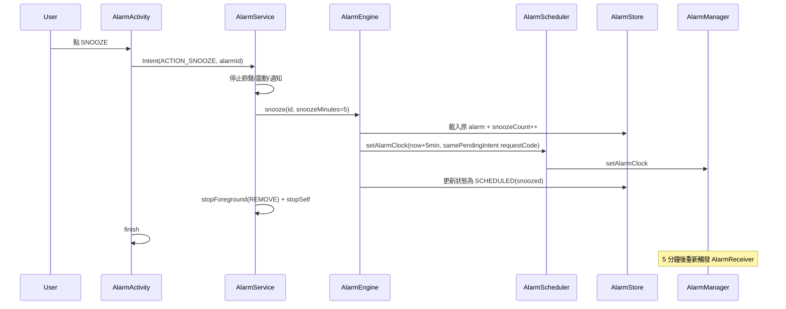
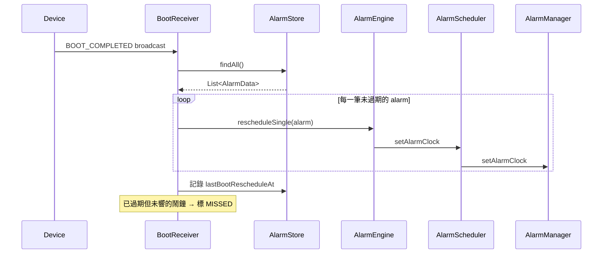

# 準點鬧鐘 — Android 鬧鐘可靠度 Spike（PoC）架構設計

> 目標:**僅** 驗證 Android 鬧鐘核心是否能達到「接近原生鬧鐘」的可靠度。
> 不含:iOS、Firebase、Calendar、Todo、RuleEngine、Database(資料先用 JSON 檔簡化)。
> 視角:資深 Android Engineer + Flutter Architect + Tech Lead。
> 版本:v1.0(2026-06)

---

## 0. TL;DR — PoC 階段的 8 個關鍵決策

| # | 決策 | 結論 | 理由 |
|---|------|------|------|
| 1 | 鬧鐘排程 API | **`AlarmManager.setAlarmClock()`** | 最高優先級、可穿透 Doze、狀態列顯示鬧鐘 icon、是 Android **系統認證**的鬧鐘語意 |
| 2 | 精確鬧鐘權限 | **`USE_EXACT_ALARM`**(不用 `SCHEDULE_EXACT_ALARM`) | 鬧鐘類 App 在 Android 13+ 享有的安裝即授予豁免,避免使用者拒絕 |
| 3 | 響鈴執行體 | **Foreground Service + Full-Screen Intent** | App 被殺也能播放,FGS 可在 BroadcastReceiver 觸發後合法啟動 |
| 4 | FGS Type(Android 14+)| **`specialUse`** + 子類型說明 | 語意正確、不被當作 mediaPlayback 誤判;Google 對鬧鐘類接受 |
| 5 | 全螢幕鬧鐘權限 | **`USE_FULL_SCREEN_INTENT`** + Play Console 宣告核心功能 | Android 14 後鬧鐘類自動授予 |
| 6 | 開機重排 | **`RECEIVE_BOOT_COMPLETED`** + BootReceiver | OS 重啟會清空所有鬧鐘,**必須**自行重排 |
| 7 | PoC 持久化 | **單一 JSON 檔 + SharedPreferences**(暫代 DB) | 聚焦驗證鬧鐘可靠度,不混入 DB 設計 |
| 8 | Flutter↔Native | **MethodChannel + EventChannel** | MethodChannel 下指令、EventChannel 推送鬧鐘事件 |

> **最重要的工程心法:Flutter 端在鬧鐘響起時可能根本沒被喚醒。** 所有「響鈴 / 顯示全螢幕 / 停止 / 貪睡」邏輯**都必須在原生層完成**,不能依賴 Dart isolate。Flutter 只負責「設定鬧鐘」與「顯示列表」。

---

## 1. 可靠度威脅模型(Threat Model)

PoC 的價值在於系統性地對抗下列威脅。先把敵人列清楚,才知道防禦對不對。

| # | 威脅 | 觸發情境 | 嚴重度 |
|---|------|----------|--------|
| T1 | App 被使用者滑掉 | 從近期使用 swipe away | 🔴 高 |
| T2 | App 被系統因記憶體壓力殺掉 | LMK / 長時間背景 | 🔴 高 |
| T3 | OEM 激進省電殺掉 | 小米 / 華為 / OPPO / vivo / 三星 | 🔴 高 |
| T4 | Doze Mode | 裝置長時間靜止、螢幕關閉 | 🟠 中 |
| T5 | App Standby Bucket | 使用者很少打開 App | 🟠 中 |
| T6 | 裝置重新開機 | OTA 升級 / 使用者重啟 | 🔴 高 |
| T7 | Direct Boot 階段 | 開機後使用者尚未解鎖 | 🟡 低-中 |
| T8 | 精確鬧鐘權限被撤銷 | 使用者於系統設定關閉 | 🟠 中 |
| T9 | 通知權限被拒(Android 13+)| 安裝後拒絕 POST_NOTIFICATIONS | 🟠 中 |
| T10 | 時區 / 時間被改變 | 旅行、夏令時間 | 🟡 低 |
| T11 | FGS 啟動失敗(Android 14/15)| FGS type 宣告錯 / 背景啟動限制 | 🔴 高 |
| T12 | 全螢幕 Intent 被阻擋 | USE_FULL_SCREEN_INTENT 未授予 | 🟠 中 |
| T13 | 螢幕鎖定 / 鎖屏遮擋 | 鬧鐘該蓋過鎖屏 | 🔴 高 |
| T14 | 靜音 / 勿擾模式 | DND 模式 | 🟠 中 |
| T15 | 同時多個鬧鐘 | 兩個鬧鐘同秒觸發 | 🟡 低 |

---

## 2. 防禦策略對照表

| 威脅 | 防禦手段 | 殘餘風險 |
|------|---------|---------|
| T1 / T2 (App 被殺) | 鬧鐘由 **AlarmManager** 持有(OS 層),觸發時用 **Foreground Service** 播放;App 死活不影響 | 極低 |
| T3 (OEM 殺) | `setAlarmClock()` 享有部分豁免;App 內提供「可靠度檢查頁」引導使用者加入電池白名單 + 自動啟動白名單 | **中**(OEM 行為無法 100% 控制) |
| T4 (Doze) | `setAlarmClock()` 為高優先,自動 whitelist;FGS 啟動後不受 Doze 限制 | 低 |
| T5 (App Standby) | 同上,`setAlarmClock` 不受 App Standby Bucket 影響 | 低 |
| T6 (重開機) | `RECEIVE_BOOT_COMPLETED` 觸發 BootReceiver → 從持久化資料重排所有鬧鐘 | 低(需自驗) |
| T7 (Direct Boot) | (PoC 階段先不處理)正式版改用 `LOCKED_BOOT_COMPLETED` + `directBootAware=true` | 中(等正式版補) |
| T8 (權限撤銷) | 監聽 `ACTION_SCHEDULE_EXACT_ALARM_PERMISSION_STATE_CHANGED`;啟動時 `canScheduleExactAlarms()` 驗證;改用 `USE_EXACT_ALARM` 永久豁免 | 極低(用 USE_EXACT_ALARM) |
| T9 (通知權限) | 啟動引導畫面 + `POST_NOTIFICATIONS` runtime 請求 | 低 |
| T10 (時間變更) | 監聽 `ACTION_TIME_CHANGED` / `ACTION_TIMEZONE_CHANGED` → 觸發重排 | 低 |
| T11 (FGS 失敗) | FGS 由 **AlarmReceiver(BroadcastReceiver)** 啟動(屬合法例外路徑);宣告正確的 `specialUse` type | 低 |
| T12 (FSI 阻擋) | `USE_FULL_SCREEN_INTENT` 權限 + Play Console 宣告核心功能 → 自動授予 | 低 |
| T13 (鎖屏) | `Activity` 設 `showWhenLocked` + `turnScreenOn`(API 27+);舊版用 Window flag | 低 |
| T14 (DND) | Notification 設 `setCategory(CATEGORY_ALARM)` + 高優先 Channel + bypassDnd | 低 |
| T15 (同秒鬧鐘) | 用唯一 `alarmId` 作為 PendingIntent requestCode;FGS 維護鬧鐘佇列 | 低 |

> **設計心法**:鬧鐘要「**寧可重複響也不可漏響**」。所有路徑優先選擇「可靠優先」,複雜度可後續優化。

---

## 3. 系統架構圖



> **關鍵路徑**(粗體):`AlarmManager → AlarmReceiver → AlarmService(FGS)→ NotificationManager → AlarmActivity`。這條路徑**完全不需要 Flutter 端存活**,是可靠度的根本保證。

---

## 4. 元件關係圖(Component Diagram)



---

## 5. Alarm 完整 Sequence Diagram

涵蓋 PoC 流程:建立鬧鐘 → 關 App → 鎖屏 → 30 秒後響鈴 → 全螢幕 → Stop/Snooze。



---

## 6. Flutter / Android 專案結構

PoC 階段刻意簡化,不引入 Drift / Riverpod 等(避免和未來架構混淆,但保留分層介面)。

```
ontime_alarm_poc/
├── lib/
│   ├── main.dart
│   ├── alarm_api/
│   │   ├── alarm_api.dart           # 抽象介面
│   │   ├── alarm_api_impl.dart      # MethodChannel/EventChannel 實作
│   │   └── alarm_models.dart        # AlarmRequest, AlarmEvent, ...
│   ├── screens/
│   │   ├── home_screen.dart         # 建立 30 秒鬧鐘的按鈕、列表
│   │   └── permission_screen.dart   # 權限引導
│   └── widgets/
│       └── alarm_tile.dart
│
├── android/app/src/main/
│   ├── AndroidManifest.xml          # 所有權限、receiver、service、activity 宣告
│   ├── kotlin/com/example/ontime/
│   │   ├── MainActivity.kt          # 註冊 AlarmPlugin
│   │   └── alarm/
│   │       ├── AlarmPlugin.kt       # MethodChannel handler
│   │       ├── AlarmEngine.kt       # 門面
│   │       ├── AlarmScheduler.kt    # AlarmManager 操作
│   │       ├── AlarmStore.kt        # JSON 持久化
│   │       ├── AlarmReceiver.kt     # BroadcastReceiver
│   │       ├── BootReceiver.kt      # BOOT_COMPLETED handler
│   │       ├── TimeChangedReceiver.kt # 時區/時間變更
│   │       ├── AlarmService.kt      # Foreground Service
│   │       ├── AlarmActivity.kt     # 全螢幕鬧鐘 UI
│   │       ├── AlarmEventBus.kt     # 推送事件給 Flutter
│   │       ├── permissions/
│   │       │   ├── PermissionChecker.kt
│   │       │   └── OemHints.kt      # OEM 偵測與引導文案
│   │       └── model/
│   │           ├── AlarmData.kt
│   │           └── AlarmEvent.kt
│   └── res/
│       ├── layout/activity_alarm.xml
│       ├── raw/default_alarm.mp3
│       └── values/strings.xml
└── pubspec.yaml
```

---

## 7. MethodChannel API 設計

> 設計原則:**指令走 MethodChannel(請求-回應),事件走 EventChannel(推送串流)**。命名統一動詞前綴,避免和未來 API 衝突。

### 7.1 Channel 名稱
- 指令:`app.ontime/alarm`(MethodChannel)
- 事件:`app.ontime/alarm_events`(EventChannel)

### 7.2 Method 清單

| Method | 參數 | 回傳 | 描述 |
|--------|------|------|------|
| `alarm.schedule` | `{ id: long, triggerAtMillis: long, title: string, ringtoneUri?: string, vibrate: bool, snoozeMinutes: int, volumeRamp: bool }` | `{ success: bool, scheduledAtMillis: long }` | 排定一個鬧鐘 |
| `alarm.cancel` | `{ id: long }` | `{ success: bool }` | 取消指定鬧鐘 |
| `alarm.cancelAll` | — | `{ success: bool }` | 取消全部(PoC 用) |
| `alarm.snooze` | `{ id: long, minutes: int }` | `{ success: bool, newTriggerAtMillis: long }` | 由 UI 主動觸發 snooze(備用,通常由 native 自處理) |
| `alarm.list` | — | `[AlarmData]` | 列出已排程鬧鐘 |
| `alarm.permissions` | — | `{ exactAlarm: bool, notification: bool, fullScreenIntent: bool, batteryOptimization: bool }` | 權限狀態查詢 |
| `alarm.requestPermissions` | `{ which: [string] }` | `{ granted: [string], denied: [string] }` | 觸發 runtime 請求 |
| `alarm.openOemSettings` | `{ vendor?: string }` | `{ opened: bool }` | 跳轉到該 OEM 的省電設定頁 |

### 7.3 Event 清單(EventChannel)

| Event | Payload | 描述 |
|-------|---------|------|
| `onAlarmFired` | `{ id, firedAtMillis }` | 鬧鐘響起(若 Flutter 存活才收到) |
| `onAlarmSnoozed` | `{ id, newTriggerAtMillis, snoozeCount }` | 鬧鐘被貪睡 |
| `onAlarmDismissed` | `{ id, dismissedAtMillis }` | 鬧鐘被停止 |
| `onAlarmMissed` | `{ id, scheduledAtMillis, detectedAtMillis }` | 偵測到漏響(下次 App 啟動掃描) |
| `onPermissionChanged` | `{ permission: string, granted: bool }` | 權限狀態變更 |

### 7.4 錯誤代碼
- `PERMISSION_DENIED`(exact alarm / notification / FSI)
- `INVALID_TIME`(triggerAt < now)
- `STORE_FAILURE`
- `SCHEDULER_FAILURE`

---

## 8. Native Alarm Engine 設計

### 8.1 元件職責

| 元件 | 職責 | 為什麼分這層 |
|------|------|-------------|
| **AlarmPlugin** | MethodChannel 入口,做參數驗證與序列化 | 隔離 Channel 細節 |
| **AlarmEngine**(門面) | 對外唯一進入點;協調 Scheduler / Store / EventBus | 後續若換實作不影響 Plugin |
| **AlarmScheduler** | 純粹包 AlarmManager;不知道 Store 存在 | 單一職責、可測試 |
| **AlarmStore** | 持久化(PoC 用 JSON,正式版換 Room) | 介面化,正式版替換無痛 |
| **AlarmReceiver** | 接收 AlarmManager broadcast,**只做** 拉起 FGS | Receiver 受 10 秒執行限制,不放重邏輯 |
| **AlarmService** | FGS:播放鈴聲、震動、發通知、處理停止/貪睡指令 | 唯一長時間執行的元件 |
| **AlarmActivity** | UI:顯示鬧鐘畫面,把使用者動作轉成 intent 給 Service | UI 與播放分離 |
| **BootReceiver** | BOOT_COMPLETED → 重排 | 開機重排是獨立關注點 |
| **AlarmEventBus** | 把 native 事件推到 Flutter | 解耦事件來源與消費 |

### 8.2 為什麼 Receiver / Service / Activity 三件套不能合併
- **Receiver** 必須在 10 秒內結束(否則 ANR),不能在這裡播放鈴聲。
- **Service** 才能長時間運作並維持鈴聲;但 Service 沒有 UI。
- **Activity** 才能顯示全螢幕 UI 並蓋過鎖屏;但 Activity 在 App 被殺時無法主動啟動,必須由 FSI 拉起。
- 三者通訊用 Intent action 與 extras,Service 維護鬧鐘狀態機。

### 8.3 鬧鐘狀態機



> AUTO_DISMISSED:響鈴超過例如 5 分鐘無人理會,自動停;否則會無限播放。

---

## 9. AlarmManager 實作策略

### 9.1 為什麼用 `setAlarmClock()`,不用 `setExactAndAllowWhileIdle()`

| API | 優先級 | Doze 行為 | 狀態列鬧鐘 icon | 適用 |
|-----|--------|----------|----------------|------|
| `set()` | 低 | 受 Doze 影響 | 無 | 不準時也沒差的提醒 |
| `setExact()` | 高 | 受 Doze 影響 | 無 | 精準但允許延遲 |
| `setExactAndAllowWhileIdle()` | 高 | 部分穿透 Doze(有頻率限制)| 無 | 偶發提醒 |
| **`setAlarmClock()`** | **最高** | **完全穿透 Doze** | **有** | **鬧鐘類 App ✓** |

`setAlarmClock()` 是 Android **明文設計給鬧鐘 App 用**的 API,系統會給它最高優先,並在狀態列顯示鬧鐘 icon 讓使用者知道。**這是 PoC 唯一正確選擇**。

### 9.2 PendingIntent 設計

```
PendingIntent.getBroadcast(
    context,
    alarm.id.toInt(),                  // requestCode = alarmId (確保不同鬧鐘 PI 不互覆蓋)
    Intent(context, AlarmReceiver::class.java).apply {
        action = "ACTION_ALARM_FIRED"
        putExtra("alarmId", alarm.id)
    },
    FLAG_UPDATE_CURRENT or FLAG_IMMUTABLE  // Android 12+ 強制 IMMUTABLE
)
```

關鍵:
- `requestCode` 用 `alarmId`,否則新鬧鐘會覆蓋舊鬧鐘的 PendingIntent。
- `FLAG_IMMUTABLE` 在 Android 12+ 是必要;否則 crash。
- `FLAG_UPDATE_CURRENT` 確保重排時更新 extras。

### 9.3 `AlarmClockInfo` 的 `showIntent`

`setAlarmClock(AlarmClockInfo(triggerAt, showIntent), operation)` 的 `showIntent` 是使用者**從狀態列點鬧鐘 icon 時**會打開的 UI(通常導向鬧鐘編輯頁)。PoC 階段可直接指向 MainActivity。

---

## 10. Foreground Service 設計

### 10.1 FGS Type 選擇(Android 14+ 必填)

| 選項 | 評估 | 結論 |
|------|------|------|
| `mediaPlayback` | 語意是「使用者主動播放音樂」,鬧鐘響鈴不符合 | ❌ Play 政策審查可能被打 |
| `dataSync` | 與資料同步無關 | ❌ |
| `shortService` | 上限 3 分鐘,但鬧鐘響鈴 + 貪睡可能更久 | ❌ |
| **`specialUse`** | 官方為「不屬於其他類別」的合法用途設計 | **✓ 選此** |

Manifest 範例:
```xml
<service
    android:name=".alarm.AlarmService"
    android:foregroundServiceType="specialUse"
    android:exported="false">
    <property
        android:name="android.app.PROPERTY_SPECIAL_USE_FGS_SUBTYPE"
        android:value="alarm_clock_ringing"/>
</service>
```

### 10.2 為什麼從 BroadcastReceiver 啟動 FGS 是合法路徑

Android 14+ 嚴禁背景啟動 FGS,但**官方文件明列例外**:`AlarmManager` 觸發的 broadcast 在 receiver 內啟動 FGS 是允許的(這就是 alarm clock 的標準範式)。**PoC 必須走這條路**,不要嘗試從其他背景路徑(如 WorkManager)啟動。

### 10.3 Notification Channel 設計

```
NotificationChannel(
    id = "alarm_firing",
    name = "鬧鐘響鈴",
    importance = IMPORTANCE_HIGH  // 必須 HIGH 才有 heads-up + FSI
).apply {
    setBypassDnd(true)                          // 穿透勿擾
    setSound(null, null)                        // 不用 channel 預設音,由 Service 自播
    enableVibration(false)                      // 由 Service 自震
    lockscreenVisibility = VISIBILITY_PUBLIC    // 鎖屏顯示
}
```

關鍵:**Channel importance 必須 HIGH(以上)**,否則 fullScreenIntent 不會自動啟動。

### 10.4 Notification 建構

```
NotificationCompat.Builder(context, "alarm_firing")
    .setSmallIcon(R.drawable.ic_alarm)
    .setContentTitle(alarm.title)
    .setContentText("鬧鐘響起")
    .setCategory(CATEGORY_ALARM)             // 系統識別為鬧鐘
    .setPriority(PRIORITY_MAX)                // 舊版裝置
    .setVisibility(VISIBILITY_PUBLIC)
    .setOngoing(true)                         // 不可滑除
    .setFullScreenIntent(fsiPendingIntent, true)  // 第二個參數 true = 高優先
    .setContentIntent(fsiPendingIntent)
    .addAction(stopAction)
    .addAction(snoozeAction)
    .build()
```

### 10.5 為什麼用自播鈴聲,不用 Channel 音
- Channel 音不能漸強。
- Channel 音被使用者調系統音量會被靜音,自播可走 `STREAM_ALARM`。
- 漸強音量、循環播放、自訂鈴聲都需 `MediaPlayer` 或 `RingtoneManager` 控制。

### 10.6 響鈴實作要點
- `AudioManager` 確保 `STREAM_ALARM` 音量未被靜音。
- `MediaPlayer` 設 `AudioAttributes.USAGE_ALARM` + `CONTENT_TYPE_SONIFICATION`,系統會把它當鬧鐘對待(穿透部分靜音)。
- 漸強:`setVolume()` 從 0.1 線性升到 1.0,Handler postDelayed 每秒一階。
- 震動:`VibrationEffect.createWaveform(pattern, 0)` 循環。
- 取得 partial wakelock 避免 CPU 休眠停播。
- 5 分鐘逾時自動 Stop(AUTO_DISMISSED)。

---

## 11. Full-Screen Alarm Activity 設計

### 11.1 顯示在鎖屏上的關鍵屬性

API 27+(推薦做法):
```kotlin
override fun onCreate(savedInstanceState: Bundle?) {
    super.onCreate(savedInstanceState)
    setShowWhenLocked(true)
    setTurnScreenOn(true)
    // Android 8.1+: 鎖屏上保持顯示、自動點亮螢幕
    val km = getSystemService(KeyguardManager::class.java)
    km.requestDismissKeyguard(this, null)  // 注意:不會解鎖,只是允許覆蓋
}
```

API 26 以下用 Window flags:`FLAG_SHOW_WHEN_LOCKED | FLAG_TURN_SCREEN_ON | FLAG_KEEP_SCREEN_ON`。

### 11.2 Activity Manifest 屬性
```xml
<activity
    android:name=".alarm.AlarmActivity"
    android:exported="false"
    android:launchMode="singleInstance"   <!-- 確保只有一個鬧鐘 UI -->
    android:excludeFromRecents="true"
    android:showOnLockScreen="true"
    android:turnScreenOn="true"
    android:taskAffinity=""               <!-- 不和主 task 混 -->
    android:theme="@style/Theme.AlarmFullScreen"/>
```

### 11.3 為什麼用 `singleInstance` + 排除 recents
- 鬧鐘 UI 與主 App task 分離,避免使用者貪睡後關掉鬧鐘 → 不小心打開主 App。
- 不出現在近期使用,符合使用者直覺。
- 同一時間最多一個鬧鐘 UI。

### 11.4 UI 設計(PoC 最簡)
- 大字時間 + 鬧鐘標題。
- 兩個大按鈕:**STOP**(右側,紅)、**SNOOZE 5min**(左側,灰)。
- 按鈕觸發 Intent 給 AlarmService,**不直接操作 AlarmManager**(由 Service 統一處理狀態機)。

### 11.5 FSI 啟動的雙路徑說明

NotificationManager 拿到一個含 `fullScreenIntent` 的高優先通知時:
- **螢幕關閉/鎖定** → 自動啟動 Activity(全螢幕)。
- **螢幕開啟且使用者正在用其他 App** → 顯示 heads-up notification,使用者點才啟動 Activity。

所以「鎖屏響鈴」對應路徑 1,需要 FSI 的權限與 Channel 設定都正確才會自動拉起。

---

## 12. Snooze 流程

### 12.1 流程



### 12.2 設計細節
- **同一個 alarmId**,只是改觸發時間。狀態機中 snoozeCount++。
- 上限:預設 max 3 次,可由設定調整;達上限後直接 AUTO_DISMISSED。
- 響鈴超過 5 分鐘無人理會 → AUTO_DISMISSED(避免無限播)。
- 貪睡時間到後仍要走完整 Receiver → Service → Activity 流程,**不偷工**。
- 貪睡期間若使用者手動 cancel,要正確清掉 PendingIntent(同 requestCode `cancel()`)。

---

## 13. Boot Recovery 流程

### 13.1 為什麼必要
**OS 重新開機會清掉所有 AlarmManager 註冊**。沒有 BootReceiver 鬧鐘就消失。

### 13.2 流程



### 13.3 Manifest 宣告
```xml
<receiver
    android:name=".alarm.BootReceiver"
    android:exported="true"
    android:enabled="true">
    <intent-filter>
        <action android:name="android.intent.action.BOOT_COMPLETED"/>
        <action android:name="android.intent.action.QUICKBOOT_POWERON"/>
        <action android:name="com.htc.intent.action.QUICKBOOT_POWERON"/>
        <action android:name="android.intent.action.MY_PACKAGE_REPLACED"/>
    </intent-filter>
</receiver>
```

### 13.4 必須處理的兼容性
- **`QUICKBOOT_POWERON`**:三星某些舊機型用此 action,不發 BOOT_COMPLETED。
- **`MY_PACKAGE_REPLACED`**:App 升級後也要重排(以防舊 PendingIntent 失效)。
- **`LOCKED_BOOT_COMPLETED` + Direct Boot**(PoC 不做,正式版補):裝置剛開機尚未解鎖前,只能用 Device Protected Storage,需要 `directBootAware=true`。

### 13.5 漏響偵測
BootReceiver 內掃描:`scheduledAt < now && state == SCHEDULED` → 標 MISSED,並透過 EventBus 通知 Flutter(下次開 App 時顯示「您有 N 個漏響的鬧鐘」)。

### 13.6 額外觸發重排的時機
- `ACTION_TIME_CHANGED`、`ACTION_TIMEZONE_CHANGED` → 全部重排。
- `ACTION_SCHEDULE_EXACT_ALARM_PERMISSION_STATE_CHANGED`(改用 USE_EXACT_ALARM 後不會收到,但留 receiver 以防)。
- App 啟動時:`onResume` 對齊一次(確保資料與 OS 排程一致)。

---

## 14. AndroidManifest 權限需求(完整清單)

```xml
<!-- 核心鬧鐘 -->
<uses-permission android:name="android.permission.USE_EXACT_ALARM"/>
<uses-permission android:name="android.permission.SCHEDULE_EXACT_ALARM"
    android:maxSdkVersion="32"/>
    <!-- API 32 以下用 SCHEDULE_EXACT_ALARM; 33+ 用 USE_EXACT_ALARM -->

<!-- 通知(Android 13+ runtime 請求)-->
<uses-permission android:name="android.permission.POST_NOTIFICATIONS"/>

<!-- 全螢幕鬧鐘 -->
<uses-permission android:name="android.permission.USE_FULL_SCREEN_INTENT"/>

<!-- Foreground Service -->
<uses-permission android:name="android.permission.FOREGROUND_SERVICE"/>
<uses-permission android:name="android.permission.FOREGROUND_SERVICE_SPECIAL_USE"/>

<!-- 開機重排 -->
<uses-permission android:name="android.permission.RECEIVE_BOOT_COMPLETED"/>

<!-- 喚醒 CPU(WakeLock)-->
<uses-permission android:name="android.permission.WAKE_LOCK"/>

<!-- 震動 -->
<uses-permission android:name="android.permission.VIBRATE"/>

<!-- 鎖屏顯示(舊 API,新版本用 showWhenLocked Activity 屬性即可)-->
<uses-permission android:name="android.permission.DISABLE_KEYGUARD"
    android:maxSdkVersion="27"/>

<!-- 引導電池白名單(系統設定頁跳轉)-->
<uses-permission
    android:name="android.permission.REQUEST_IGNORE_BATTERY_OPTIMIZATIONS"/>
```

> **Play Console 必做**:在 App content → "Use of full-screen intent permission" 勾選「核心功能是鬧鐘」,才能在 Android 14+ 自動授予 `USE_FULL_SCREEN_INTENT`。

---

## 15. Android 14 / 15 注意事項

| 議題 | Android 14 (API 34) | Android 15 (API 35) | 我們的對策 |
|------|---------------------|---------------------|-----------|
| `SCHEDULE_EXACT_ALARM` 預設拒絕 | 是 | 是 | 改用 `USE_EXACT_ALARM`(鬧鐘類豁免,安裝即授予) |
| FGS type 必填 | 是 | 是 | 宣告 `specialUse` + 子類型 |
| `FOREGROUND_SERVICE_SPECIAL_USE` 權限 | 必加 | 必加 | 已加入 manifest |
| `USE_FULL_SCREEN_INTENT` 變成 special access | 是 | 是 | Play Console 宣告核心功能 → 自動授予 |
| 背景啟動 FGS 限縮 | 嚴格 | 更嚴 | 走 AlarmManager broadcast 觸發(官方例外路徑) |
| `SYSTEM_ALERT_WINDOW` 啟動 FGS 路徑收緊 | — | 是 | 不走此路徑,不受影響 |
| `dataSync` / `mediaProcessing` 限時 | — | 6 小時/上限 | 我們用 `specialUse`,無此限制 |
| Notification trampoline 限制 | 已限 | 已限 | Service 直接拉 Activity,不透過 trampoline activity |
| `MY_PACKAGE_REPLACED` 取代 `PACKAGE_REPLACED` | — | 強化 | 已宣告 |
| 接收 `BOOT_COMPLETED` 需可見性 | 仍 OK(鬧鐘類例外) | 仍 OK | 已宣告 |

---

## 16. OEM 省電風險分析

> **這是 PoC 階段最大的不確定性。** Stock Android 上一切照規格運作,OEM 客製化會打折扣。下表是各廠經驗值,實機驗證才作數。

| 廠牌 | 主要殺手機制 | 對 `setAlarmClock` 寬容度 | PoC 建議測試動作 |
|------|-------------|--------------------------|------------------|
| **Pixel(Stock)** | Doze + App Standby(標準)| 高(完全照規格)| 基準對照 |
| **Samsung(One UI)** | Smart Manager「使其進入睡眠」+ 自動最佳化 | 中-高 | 設定 → 電池 → 將 App 加入「未受監測 App」白名單 |
| **小米(MIUI/HyperOS)** | 自啟動限制 + 神隱模式 + 電池最佳化 | **低** | 「自啟動」開啟、「省電策略」設「無限制」、鎖定近期任務 |
| **OPPO/realme(ColorOS)** | 電池守護程式 + 自啟動管理 | **低** | 設定 → 電池 → 「應用程式耗電量管理」→ 允許背景活動 |
| **vivo(OriginOS)** | iManager + 自啟動 + 高耗電 | **低** | iManager → 應用管理 → 自啟動;設定 → 電池 → 背景耗電管理 |
| **華為/榮耀(EMUI/MagicOS)** | PowerGenie + 受保護 App 名單(不在名單就被殺)| **極低** | 加入「受保護 App」名單;部分機型需第三方 ADB 指令才能徹底解決 |

### 16.1 對策
1. **第一次啟動引導頁**:偵測 `Build.MANUFACTURER`,顯示對應廠牌的設定步驟與截圖。
2. **電池白名單**:`ACTION_REQUEST_IGNORE_BATTERY_OPTIMIZATIONS` intent 引導使用者一鍵加入。
3. **可靠度檢查頁**(設定內):列出所有關鍵權限與 OEM 設定狀態,紅綠燈呈現。
4. **誠實聲明**:在 Play 商店描述與 App 內告知:「在某些 OEM 上需額外設定才能保證可靠度」。

### 16.2 殘餘風險:無法 100% 控制
即便完整防禦,**部分 OEM 在使用者長期未開 App 後仍可能停掉鬧鐘**(尤其華為/小米/vivo)。這是業界已知問題(參考 dontkillmyapp.com)。**PoC 要把這當作可量測指標,不是 bug**。

### 16.3 PoC 測試矩陣(實機優先順序)
1. **Pixel(Android 14 / 15)**:基準。
2. **Samsung 中階機(One UI 7+)**:市占最大。
3. **小米中階機(HyperOS)**:OEM 風險代表。
4. **OPPO / vivo**:亞洲市場代表。
5. 可選:華為(中國市場若是目標)。

---

## 17. PoC 驗證 Checklist

### 17.1 功能性(Function)

| # | 項目 | 通過標準 |
|---|------|---------|
| F1 | 建立 30 秒後鬧鐘 | UI 收到 success,狀態列出現鬧鐘 icon |
| F2 | App 在前景時響鈴 | 30s 後 AlarmActivity 自動出現、鈴聲響起 |
| F3 | App 在背景(按 Home)響鈴 | 同上 |
| F4 | App 被使用者滑掉後響鈴 | 同上(關鍵測試) |
| F5 | 鎖屏狀態響鈴 | 鎖屏自動點亮 + 全螢幕鬧鐘 UI 出現 |
| F6 | 點 Stop | 鈴聲立即停、通知消失、Activity 關閉 |
| F7 | 點 Snooze(5 分鐘)| 鈴聲停、5 分鐘後重新響起 |
| F8 | Snooze 後再 Snooze | 累計到上限正常 AUTO_DISMISSED |
| F9 | 重開機後鬧鐘仍會響 | 開機完成後等待原排定時間 → 響鈴 |
| F10 | 多個鬧鐘並存 | 排兩個間隔 30 秒的鬧鐘,兩個都響 |
| F11 | 同時觸發兩個鬧鐘 | 第二個排入佇列、第一個結束後接著響 |

### 17.2 權限與 UX

| # | 項目 | 通過標準 |
|---|------|---------|
| P1 | Android 14+ `USE_EXACT_ALARM` 安裝即授予 | `canScheduleExactAlarms()` 回傳 true |
| P2 | Android 13+ 通知權限請求流程 | 第一次啟動正確請求 |
| P3 | `USE_FULL_SCREEN_INTENT` 授予 | Play Console 宣告後安裝即授予 |
| P4 | 通知 Channel 顯示為「鬧鐘」分類 | 系統設定 → App 通知 → 看到 alarm channel |
| P5 | 鬧鐘 icon 出現於狀態列 | 排程後立即出現 |

### 17.3 可靠性(Reliability)

| # | 項目 | 通過標準 |
|---|------|---------|
| R1 | Doze 模式測試 | `adb shell dumpsys deviceidle force-idle` 後仍會響 |
| R2 | App Standby Bucket 測試 | `adb shell am set-standby-bucket <pkg> rare` 後仍會響 |
| R3 | 移除最近任務 + 等待 30 分鐘 | Pixel 必須通過;OEM 機型記錄結果 |
| R4 | 螢幕關閉長時間(>2 小時)後響鈴 | 必須準時 |
| R5 | 連續排 20 個鬧鐘 | 全部正確觸發 |
| R6 | 時間改變(向後撥 1 小時) | 鬧鐘相對時間正確 |
| R7 | 飛航模式 | 鬧鐘照響(本地不依賴網路) |
| R8 | 低電量模式 | 鬧鐘照響 |
| R9 | OEM 測試矩陣(見 16.3) | 每台記錄通過/失敗 |

### 17.4 自動化驗證指令(adb)

```
# 強制進入 Doze
adb shell dumpsys deviceidle force-idle deep

# 模擬重開機(不真重啟,僅測 BootReceiver)
adb shell am broadcast -a android.intent.action.BOOT_COMPLETED -p com.example.ontime

# 檢查鬧鐘是否在系統佇列
adb shell dumpsys alarm | grep -A 3 com.example.ontime

# 強殺 App
adb shell am force-stop com.example.ontime

# 觀察 FGS 狀態
adb shell dumpsys activity services com.example.ontime
```

---

## 18. 建議開發順序(逐步驗證、單元最小)

| 階段 | 內容 | 通過條件 |
|------|------|---------|
| **S1** | Android 原生純粹版:一個 Activity 按鈕 → `setAlarmClock` → AlarmReceiver → Log | adb logcat 看到「鬧鐘響了」字串 |
| **S2** | + Foreground Service + 鈴聲播放 | App 殺掉後 30 秒,鈴聲仍會響 |
| **S3** | + AlarmActivity 全螢幕 UI | 鎖屏狀態能自動拉起 UI |
| **S4** | + Stop / Snooze 完整狀態機 | Snooze 後正確重排,Stop 後完全清乾淨 |
| **S5** | + AlarmStore 持久化(JSON) | App 重啟後仍知道有哪些 alarms |
| **S6** | + BootReceiver 重排 | 真實重啟手機後鬧鐘仍會響 |
| **S7** | + MethodChannel 接 Flutter UI | 從 Flutter 端能完整操作 |
| **S8** | + EventChannel 推送事件 | Flutter 端能收到 fired/snoozed/dismissed |
| **S9** | + 權限引導頁 + OEM 偵測 | 安裝後第一次能完成設定 |
| **S10** | + 跑完整 17 章 Checklist | 在至少 3 種 OEM 機型上驗證 |

> **strong 建議:S1 - S6 全部用純 Kotlin 完成,只有最後才接 Flutter。** 這樣可靠度問題能與 Flutter 橋接問題分離,debug 容易非常多。

---

## 19. 殘餘風險與不能保證的事

Spike 結束後,你需要對團隊誠實說明的限制:

1. **OEM 殺手機制**:華為 / 小米某些情境即使做齊,長時間未開仍可能漏響。**業界無解**,只能引導使用者。
2. **使用者主動關權限**:鎖鏈中任一環(`USE_EXACT_ALARM` 撤銷、通知關閉、電池最佳化開啟)都會破功;需在 App 啟動時偵測並引導。
3. **AlarmKit 等級的「穿透靜音」在 Android 沒有官方對等物**。即便高優先 Channel,使用者強制靜音時仍可能不響(我們改用 STREAM_ALARM 自播 + AudioAttributes USAGE_ALARM 已是上限)。
4. **Direct Boot 階段**(剛開機未解鎖):PoC 不處理,正式版必須補。在這段期間鬧鐘無法觸發 UI(但可發通知)。
5. **Doze 在極端情境下仍可能延遲**:`setAlarmClock` 已是最高優先,但若 OEM 客製化 Doze 邏輯,行為不可預測。

---

## 20. 推薦工具(PoC 階段)

| 用途 | 工具 |
|------|------|
| Log 工具 | Android Studio Logcat + Timber(原生)/ logger(Flutter) |
| 壓力測試 | adb 指令(見 17.4)+ Doze 模擬工具 |
| 通知行為觀察 | `adb shell dumpsys notification` |
| AlarmManager 排程觀察 | `adb shell dumpsys alarm \| grep <pkg>` |
| 電池統計 | `adb shell dumpsys batterystats --reset` 後等待,再 `--checkin` |
| OEM 行為參考 | dontkillmyapp.com、各 OEM 開發者文件 |
| 通知 Channel 設計參考 | Android 官方 Material Notification Guide |

---

## 結語:PoC 的成功定義

**這個 Spike 不是「做出能響的鬧鐘」**(那很簡單),**而是回答以下三個問題**:

1. 在 **Pixel + Android 14/15** 上,我們是否能達到「與系統 Clock App 一致」的響鈴體驗?(目標:**是**)
2. 在 **主流 OEM(三星、小米、OPPO、vivo)** 上,經過適當引導後,可靠度落差有多大?(目標:**量化、可接受**)
3. Flutter 橋接層是否會對可靠度造成任何影響?(目標:**完全不會**——鬧鐘流程全在 native 自閉路)

如果三個答案都達標,你就有信心把這套架構放進正式版,並把工程預算放在 Calendar、RuleEngine、Sync 上。如果不達標,你會清楚知道是「不可逾越的平台限制」還是「我們的設計待改」——這正是 PoC 最大的價值。
