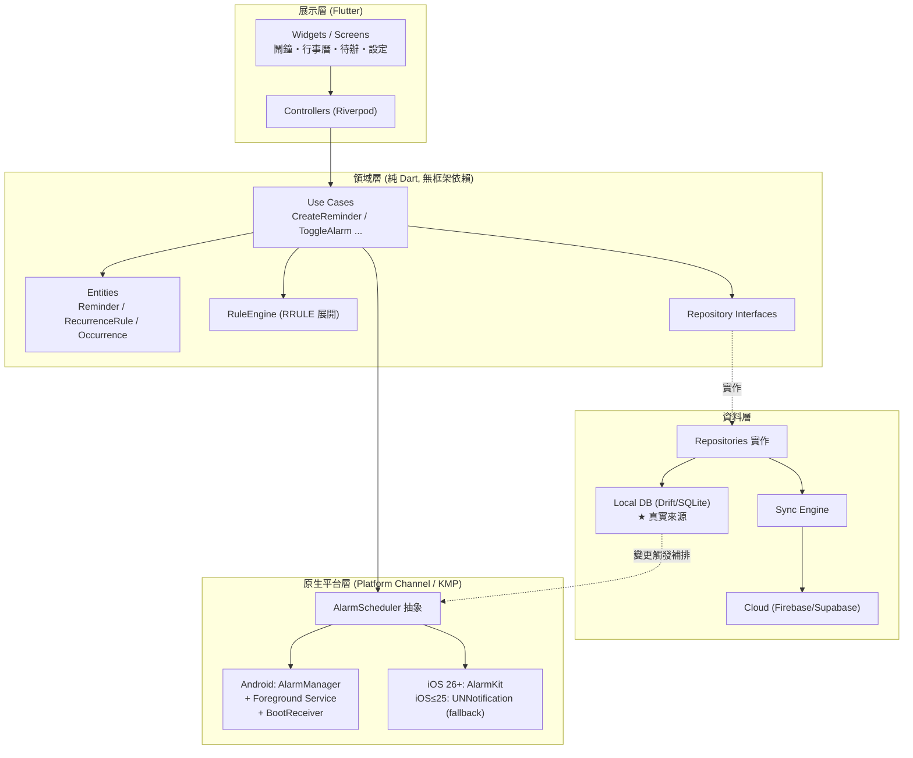
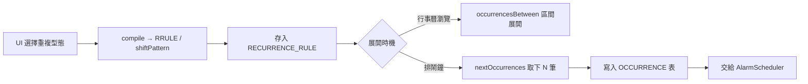
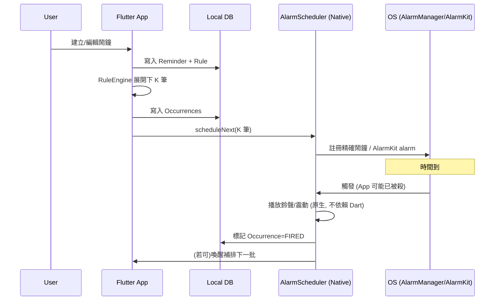
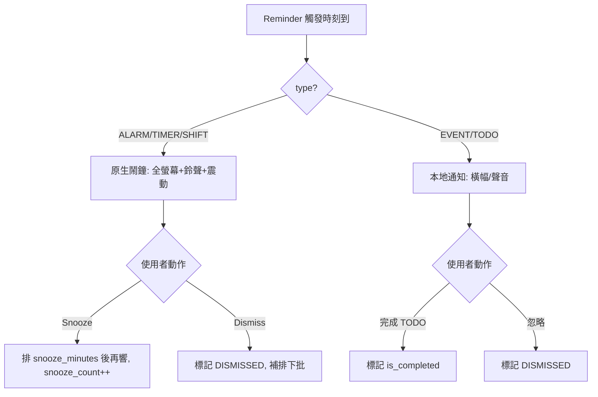
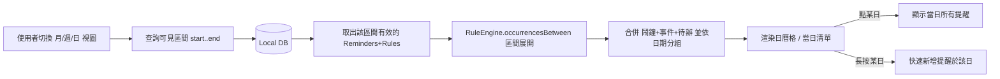
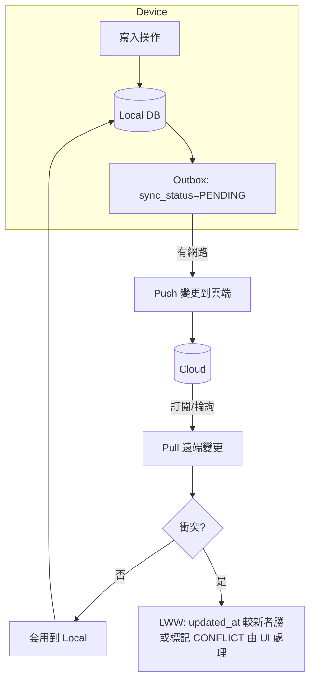
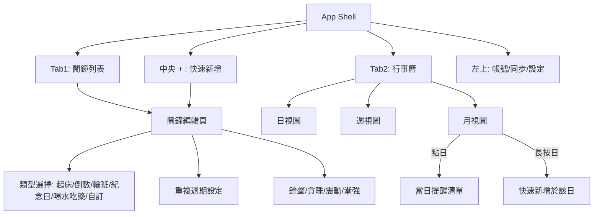

# 準點鬧鐘（On-Time Alarm）— 產品與工程架構設計文件

> 定位：**鬧鐘 + 行事曆 + 待辦提醒** 的整合型時間管理工具（Android / iOS）。
> 本文件以「資深 App 架構師 + PM + Tech Lead」角度撰寫，目標是讓你能**直接進入開發**。
> 版本：v1.0　最後更新：2026-06

---

## 0. 摘要：你只需要先記住這 7 個決策（TL;DR）

| # | 決策項 | 結論 | 一句話理由 |
|---|--------|------|-----------|
| 1 | **前端框架** | **Flutter（MVP 首選）** | UI/行事曆開發最快、套件成熟；鬧鐘核心仍走原生模組（無論哪個框架都得寫原生）。若團隊 Kotlin 強、要長期最高原生擬真度 → KMP。 |
| 2 | **鬧鐘核心** | **原生為主、Flutter 為殼** | iOS 走 **AlarmKit（iOS 26+）**、Android 走 **AlarmManager + Foreground Service + Boot Receiver**。 |
| 3 | **本地資料庫** | **SQLite（Drift）= 唯一真實來源（Source of Truth）** | Offline-first 的命脈；鬧鐘必須離線可靠。 |
| 4 | **重複規則引擎** | **以 RFC 5545 RRULE 為基礎** | 「每天/每週/每月/每年/隔月/隔年/自訂星期/工作日」全部用一套標準表達，免得自己造輪子。 |
| 5 | **雲端** | **MVP 用 Firebase（Auth + Firestore + FCM）**；要 SQL/資料主權 → Supabase | 雲端只是「備份 + 多裝置同步」，不是真實來源。 |
| 6 | **狀態管理** | **Riverpod** | 可測試、編譯期安全、適合 Clean Architecture。 |
| 7 | **架構** | **Clean Architecture + Feature-first 資料夾** | 鬧鐘引擎、行事曆、同步要能各自擴充與測試。 |

**最關鍵的工程洞見：你不能把所有未來鬧鐘都排進 OS。** iOS 通知上限 64 個、Android 有資源限制。正解是「**滾動視窗排程**」：規則存 DB → 只把「接下來 N 個」實體化並丟給 OS → 每次響鈴/開機/開 App 時補排下一批。這是整個系統的心臟，第 7、8 章詳述。

---

## 1. 產品定位與設計原則

### 1.1 三合一的資料統一觀
傳統做法會把「鬧鐘」「行事曆事件」「待辦」做成三個資料表，導致行事曆同步顯示困難。本設計採用**統一 Reminder 模型**：所有東西都是一個 `Reminder`，用 `type` 區分行為。

```
Reminder.type ∈ { ALARM, TIMER, EVENT, TODO, SHIFT }
```

好處：行事曆只要查「某天有哪些 Reminder」就能一次顯示鬧鐘+事件+待辦，天然同步。

### 1.2 設計原則
1. **Offline-first**：本地 DB 是真實來源，雲端是附屬。沒網路也要 100% 可用。
2. **Reliability-first（鬧鐘層）**：鬧鐘寧可重複響也不可漏響；所有狀態變更都要能在開機後重建。
3. **Rule, not Instances**：存「規則」而非「每一筆未來實例」；實例按需展開。
4. **Native where it matters**：UI 可跨平台，鬧鐘觸發必走原生。

---

## 2. 技術選型分析與決策

### 2.1 為什麼框架選擇沒你想的那麼關鍵
高穩定鬧鐘的可靠度 **100% 取決於原生排程 API**（AlarmManager / AlarmKit）與 OEM 省電策略，不是取決於 Flutter / RN / KMP。**任何框架你都得寫原生鬧鐘模組。** 所以框架真正要比的是：UI 開發速度、原生橋接的穩定度、長期維護成本。

### 2.2 三框架對比

| 維度 | Flutter | React Native | Kotlin Multiplatform (KMP) |
|------|---------|--------------|----------------------------|
| 背景執行/鬧鐘 | 走 Platform Channel 接原生；`alarm`、`android_alarm_manager_plus`、`flutter_alarmkit` 等現成套件 | 走 TurboModule 接原生；可行但橋接較脆弱、社群鬧鐘方案零散 | **最佳**：Android 直接寫 Kotlin、iOS 寫 Swift，business logic 共用 |
| 系統通知 | 套件成熟（`flutter_local_notifications`） | 套件成熟但分裂 | 各平台原生，最完整 |
| 開發速度 | **最快**（單一 UI codebase + 熱重載） | 快 | 慢（UI 要嘛各平台原生、要嘛 Compose Multiplatform） |
| UI 表現 | **優**（自繪引擎，行事曆動畫好做） | 良（接近原生元件） | 視 UI 方案而定，Compose MP 已可用但 iOS 仍年輕 |
| 原生能力存取 | 需橋接，但生態完整 | 需橋接 | **最強**（直接原生） |
| 長期維護 | 佳，Google 支持 | 視套件健康度 | 佳，但人才較難找、iOS 端較新 |
| Plugin 生態 | **最大** | 大但品質參差 | 成長中，鬧鐘類較缺 |

### 2.3 決策（Tech Lead 觀點）

- **MVP / 小團隊 / 要快 → Flutter。** 行事曆 + 待辦 + 設定 UI 佔 App 80% 工作量，Flutter 做得又快又漂亮；鬧鐘引擎用原生模組封在乾淨的 Dart 介面後面（`AlarmEngine` 抽象）。
- **團隊 Kotlin 強、要最高原生擬真、長期產品 → KMP。** 共用 RuleEngine/Models/Sync,UI 各平台原生。代價是初期較慢。
- **不建議 RN 做這類「鬧鐘為核心」的 App**:可行,但你會把時間花在橋接可靠度上,而不是產品。

> 本文件後續以 **Flutter** 為主示範(資料夾、套件),但所有架構概念對 KMP 同樣適用。

---

## 3. 雲端：Firebase vs Supabase

### 3.1 先釐清雲端的角色
因為是 offline-first、本地 DB 是真實來源,**雲端只負責**:使用者登入、跨裝置同步、換手機備援。鬧鐘**永遠不依賴雲端觸發**。

### 3.2 對比

| 維度 | Firebase | Supabase |
|------|----------|----------|
| 資料模型 | NoSQL（Firestore），存遞迴規則/關聯較彆扭 | **PostgreSQL**,RRULE、關聯、查詢天然合適 |
| Offline 同步 | **內建**(Firestore 離線持久化 + 自動同步),少寫很多 code | 非內建,需自建(PowerSync / 自寫同步層) |
| Auth | turnkey(Google/Apple/Email) | turnkey + Row Level Security 很強 |
| 推播 | **FCM 原生整合** | 需另接 FCM/APNs |
| 資料主權/可攜性 | 鎖定較深 | **開源、可自架、標準 SQL** |
| 成本可預測性 | 用量計費,爆量時較難預估 | 較線性,接近傳統 DB |
| MVP 速度 | **最快** | 中(同步要自己想) |

### 3.3 決策
- **MVP → Firebase（Auth + Firestore + FCM）。** 內建離線同步省下大量同步程式碼,最快上線。
- **若你重視資料主權、SQL 關聯查詢、或預期長期規模 → Supabase**,但要搭配本地 SQLite + 一套同步策略(見第 11 章)。
- **折衷務實做法(推薦)**:不管選哪家,本地都用 SQLite 當真實來源,雲端只做「Reminder 文件層級」的同步。這樣換雲端供應商成本低。

---

## 4. App 整體架構圖



**資料流向總綱**:UI → UseCase → Repository →(寫入)本地 DB →(觸發)AlarmScheduler 重排 OS 鬧鐘;同步引擎在背景把本地變更推到雲端、並把雲端變更拉回本地。

---

## 5. 技術架構（Tech Stack）

| 層 | 選用 |
|----|------|
| UI 框架 | Flutter (Dart 3) |
| 狀態管理 | Riverpod + `riverpod_generator` |
| 路由 | go_router |
| 本地 DB | Drift（型別安全 SQLite,支援 migration、reactive query) |
| 重複規則 | `rrule` 套件(RFC 5545) |
| 鬧鐘排程 | 原生模組:Android `AlarmManager`、iOS `AlarmKit`;Flutter 端封裝為 `AlarmScheduler` |
| 通知 | `flutter_local_notifications`(行事曆/待辦提醒) + 原生鬧鐘 |
| 雲端 | Firebase Auth / Firestore / FCM(MVP) |
| 時區 | `timezone` 套件(DST 必備) |
| 序列化 | `freezed` + `json_serializable` |
| DI | Riverpod providers |

---

## 6. Database Schema

> 設計重點:**統一 Reminder 模型**、**規則與實例分離**、**為同步而生的軟刪除與版本欄位**。

### 6.1 ER 圖

```mermaid
erDiagram
    USER ||--o{ REMINDER : owns
    REMINDER ||--o| RECURRENCE_RULE : has
    REMINDER ||--o{ OCCURRENCE : generates
    REMINDER ||--o| ALARM_CONFIG : "if type=ALARM"

    USER {
        string id PK
        string email
        string display_name
        int created_at
    }
    REMINDER {
        string id PK
        string user_id FK
        string type "ALARM|TIMER|EVENT|TODO|SHIFT"
        string title
        string note
        int start_at "epoch ms (本地時間錨點)"
        string timezone "IANA, e.g. Asia/Taipei"
        string recurrence_rule_id FK
        bool is_enabled
        bool is_completed "TODO 用"
        int completed_at
        int created_at
        int updated_at
        bool is_deleted "軟刪除,供同步"
        int version "樂觀鎖/同步版本"
        string sync_status "SYNCED|PENDING|CONFLICT"
    }
    RECURRENCE_RULE {
        string id PK
        string freq "NONE|DAILY|WEEKLY|MONTHLY|YEARLY"
        int interval "隔月=MONTHLY+2; 隔年=YEARLY+2"
        string by_weekday "MO,TU,... (自訂星期/工作日)"
        string by_monthday "1,15,-1"
        string by_month "1..12"
        string times_of_day "08:00,12:00,18:00 (一天多次)"
        int count "重複次數上限,可空"
        int until "結束日期 epoch,可空"
        string rrule_string "RFC5545 原字串,真實來源"
    }
    ALARM_CONFIG {
        string reminder_id PK_FK
        string ringtone_uri
        bool vibrate
        bool volume_ramp "漸強"
        int snooze_minutes
        int snooze_max_count
        string shift_pattern "輪班: 上班2天休1天 等 JSON"
    }
    OCCURRENCE {
        string id PK
        string reminder_id FK
        int scheduled_at "這個實例該響的時間"
        string state "PENDING|FIRED|SNOOZED|DISMISSED|MISSED"
        int snooze_count
        int fired_at
        bool os_scheduled "是否已交給 OS"
    }
```

### 6.2 為什麼要 `OCCURRENCE`(實例表)?
- **行事曆顯示**:某天要顯示哪些提醒,直接查實例最快。
- **狀態追蹤**:貪睡幾次、是否已忽略、是否漏響(MISSED)。
- **OS 排程記帳**:記錄哪些實例已交給 OS(`os_scheduled`),避免重複排或漏排。

實例**不需要全量產生**,只物化「規則展開後的下一段視窗」(例如未來 60 天 / 接下來 50 筆),其餘按需展開。

---

## 7. Reminder Rule Engine 設計（可擴充的核心）

### 7.1 核心思想:用 RRULE 統一所有重複型態
不要自己發明欄位組合。把使用者選的「每天/每週/隔月/工作日…」全部編譯成一條 **RFC 5545 RRULE 字串**,存進 `recurrence_rule.rrule_string`。展開時交給 `rrule` 函式庫算出時間序列。

| 使用者選項 | RRULE |
|-----------|-------|
| 每天 | `FREQ=DAILY` |
| 每週(一三五) | `FREQ=WEEKLY;BYDAY=MO,WE,FR` |
| 每月 15 號 | `FREQ=MONTHLY;BYMONTHDAY=15` |
| 每年 | `FREQ=YEARLY` |
| 隔月 | `FREQ=MONTHLY;INTERVAL=2` |
| 隔年 | `FREQ=YEARLY;INTERVAL=2` |
| 工作日 | `FREQ=WEEKLY;BYDAY=MO,TU,WE,TH,FR` |
| 指定到某日結束 | `...;UNTIL=20261231T000000Z` |
| 共響 10 次 | `...;COUNT=10` |

**一天多次**與**輪班**是 RRULE 無法直接表達的兩個特例,用「組合」處理:
- **一天多次**:`times_of_day` 欄位 × RRULE 的日期序列 → 笛卡兒積。例如 `FREQ=DAILY` + `08:00,12:00,18:00` = 每天三筆實例。
- **輪班(2 上 1 休)**:用 `shift_pattern`(JSON,如 `{cycleDays:3, onDays:[0,1]}`)+ 起始錨點,自訂展開器產生序列。

### 7.2 引擎介面

```
abstract class RuleEngine {
  /// 從某時間起,展開接下來 N 個觸發時刻
  List<DateTime> nextOccurrences(RecurrenceRule rule, {DateTime from, int limit});

  /// 展開某時間區間內所有觸發(給行事曆用)
  List<DateTime> occurrencesBetween(RecurrenceRule rule, {DateTime start, DateTime end});

  /// 把使用者 UI 選項編譯成 RRULE
  RecurrenceRule compile(UserRecurrenceInput input);
}
```

### 7.3 展開流程



> **時區與 DST 必坑**:所有展開都要帶 IANA 時區(`Asia/Taipei`)用 `timezone` 套件計算,不能用 UTC offset 硬算,否則跨日光節約時間會錯一小時。

---

## 8. Alarm Engine 設計（系統心臟）

### 8.1 滾動視窗排程（Rolling Window Scheduling）
**問題**:iOS 通知上限 64、Android 排太多精確鬧鐘耗資源,無法把無限未來鬧鐘全排進 OS。

**解法**:
1. DB 永遠存「規則」。
2. 只把**接下來 K 個**(建議 iOS ≤ 50、Android ≤ 100)實例交給 OS。
3. **觸發補排**:每次鬧鐘響、App 開啟、裝置開機、權限變更時 → 清掉過期實例、補排下一批。



### 8.2 平台實作對照

**Android**
- 權限:鬧鐘類 App 宣告 `USE_EXACT_ALARM`(安裝即授予,免使用者手動開);舊機 fallback `SCHEDULE_EXACT_ALARM`(用 `maxSdkVersion` 限制),並提供導引使用者到「鬧鐘與提醒」設定頁的 UX。
- API:`AlarmManager.setAlarmClock()`(最高優先、可穿透 Doze,且會在系統狀態列顯示鬧鐘 icon)。
- 響鈴時:用 **Foreground Service** 播放鈴聲 + 全螢幕 Intent(`fullScreenIntent`)叫出鬧鐘畫面,即使 App 被殺也能運作。
- **開機重排**:`RECEIVE_BOOT_COMPLETED` BroadcastReceiver,在 `BOOT_COMPLETED` 時重讀 DB 重排(OS 重開機會清掉所有鬧鐘)。

**iOS**
- **iOS 26+**:用 **AlarmKit** `AlarmManager`。可穿透靜音/專注、鎖定畫面全螢幕、Dynamic Island。需在 Info.plist 加 `NSAlarmKitUsageDescription` 並請求授權。注意:AlarmKit 只播本機音效、不喚醒 App、且抓不到「使用者滑掉」事件——貪睡/停止要靠它內建的 UI 按鈕。
- **iOS ≤ 25(fallback)**:`UNNotificationRequest` + Critical Alert(需向 Apple 申請 entitlement)。可靠度較低,要在 UI 明確告知使用者升級 iOS 26 才有最佳體驗。

### 8.3 抽象介面(Flutter 端)
```
abstract class AlarmScheduler {
  Future<void> schedule(Occurrence occ, AlarmConfig cfg);
  Future<void> cancel(String occurrenceId);
  Future<void> cancelAll();
  Future<void> rescheduleWindow(); // 補排下一批
  Stream<AlarmEvent> events();      // FIRED / SNOOZED / DISMISSED (Android 可拿到)
}
```
平台判斷在原生層:iOS 偵測版本走 AlarmKit 或通知 fallback;Android 走 AlarmManager。

---

## 9. Notification / Reminder Flow

區分兩類:
- **鬧鐘(ALARM/TIMER/SHIFT)**:走第 8 章的 AlarmScheduler(原生、高可靠、會響鈴)。
- **軟提醒(EVENT/TODO)**:走 `flutter_local_notifications`(一般通知,可被靜音,適合「下午兩點開會」這種非命脈提醒)。



---

## 10. Calendar 資料流



要點:
- 行事曆**不查實例表也行**——直接用 RuleEngine 對可見區間展開(reactive),確保即使尚未物化也看得到。
- 切換月份時只展開可見區間,避免一次算太多。
- 用 `table_calendar` 套件做月/週視圖外框,日視圖自繪時間軸。

---

## 11. Offline-first 設計

### 11.1 真實來源原則
本地 SQLite 是唯一真實來源。**所有讀寫先打本地**,UI 立即反應(樂觀更新),同步在背景進行。

### 11.2 同步模型



- **衝突解決**:預設 **Last-Write-Wins(以 `updated_at`)**;鬧鐘類資料衝突罕見,LWW 足夠。重要欄位可升級為欄位級合併。
- **軟刪除**:刪除只設 `is_deleted=true` + bump `version`,確保刪除動作能同步到其他裝置(否則刪掉的會被另一台「復活」)。
- **離線完全可用**:沒網路時鬧鐘照響(本地 DB + OS 排程),只是不同步;恢復網路後 Outbox 自動補送。
- 若用 **Firebase**:Firestore 內建離線持久化幫你做掉大半;若用 **Supabase**:需自建 Outbox/Pull 或導入 PowerSync。

---

## 12. 背景執行與平台限制深度分析

### 12.1 Android
| 議題 | 對策 |
|------|------|
| Doze / App Standby | 用 `setAlarmClock()` / `setExactAndAllowWhileIdle()`,可穿透 Doze |
| 精確鬧鐘權限 | 鬧鐘類 App 用 `USE_EXACT_ALARM`(安裝即授予) |
| App 被殺 | 鬧鐘由 OS(AlarmManager)持有,觸發時拉起 Foreground Service,不依賴 App 存活 |
| 重開機清空 | `BOOT_COMPLETED` Receiver 重排 |
| **OEM 省電殺手** | 小米/華為/OPPO/三星等會殺背景。對策:引導使用者關閉該 App 的電池最佳化、加白名單;參考 dontkillmyapp.com 各廠牌做法;App 內提供「鬧鐘可靠度檢查」引導頁 |
| 全螢幕鬧鐘 | `USE_FULL_SCREEN_INTENT` 權限 + fullScreenIntent |

### 12.2 iOS
| 議題 | 對策 |
|------|------|
| 背景執行受限 | iOS 不給長背景;鬧鐘交給系統 |
| iOS 26+ | **AlarmKit**:系統級,穿透靜音/專注,鎖定畫面全螢幕。最佳解 |
| iOS ≤ 25 | 退回本地通知;Critical Alert 需 Apple 特批 entitlement |
| 通知上限 64 | 滾動視窗排程,只排接下來 ≤50 筆 |
| AlarmKit 限制 | 只播本機音效、不喚醒 App、抓不到滑掉事件;貪睡靠其內建 UI |
| App 被殺 | AlarmKit 由系統持有,不受影響;通知 fallback 同樣由系統持有 |

### 12.3 「接近原生穩定性」的可靠度清單
1. Android 用 `setAlarmClock` + Foreground Service + Boot Receiver。
2. iOS 26+ 全面用 AlarmKit。
3. 滾動視窗 + 每次 App 啟動/開機/權限變更時補排 + 校驗。
4. 引導使用者處理 OEM 省電(Android)與授權(雙平台)。
5. 「漏響偵測」:App 啟動時掃描 `scheduled_at < now 且 state=PENDING` 的實例 → 標 MISSED 並提示使用者(誠實面對偶發漏響)。

---

## 13. UI / UX 架構

### 13.1 設計語彙
極簡、Notion × Google Calendar × iPhone Clock 融合;深色模式優先;動畫克制(僅轉場與微互動);大字級時間顯示;主色用單一強調色(參考你提供的紅色強調)。

### 13.2 導覽結構（底部 3 Tab + 中央新增）



### 13.3 頁面結構
- **鬧鐘列表**:卡片式,顯示時間、標題、重複摘要、距離下次響的倒數、開關 toggle。
- **編輯頁**:頂部大滾輪時間選擇 → 類型 → 標題 → 重複 → 鈴聲 → 貪睡 → 備註 → 提前提醒。
- **行事曆**:月/週/日切換;當日清單在下半部;長按新增。
- **設定/帳號**:登入、雲端同步狀態、鬧鐘可靠度檢查、深淺色、預設鈴聲。

### 13.4 UX 原則
- 新增鬧鐘 ≤ 3 步可完成(時間→存)。
- 危險的省電/權限引導用「漸進式」:只有偵測到風險才提示。
- 響鈴畫面:超大停止鍵 + 貪睡鍵,避免半睡誤觸。

---

## 14. Folder Structure（Flutter, Feature-first + Clean Architecture）

```
lib/
├── main.dart
├── app/
│   ├── app.dart                 # MaterialApp, router
│   ├── router.dart              # go_router
│   └── theme/                   # 深淺色、設計 token
├── core/
│   ├── error/                   # Failure, Exception
│   ├── utils/                   # 時間、時區工具
│   ├── constants/
│   └── providers/               # 全域 Riverpod providers
├── features/
│   ├── reminder/
│   │   ├── domain/
│   │   │   ├── entities/        # Reminder, RecurrenceRule, Occurrence
│   │   │   ├── repositories/    # 介面
│   │   │   └── usecases/        # CreateReminder, ToggleAlarm...
│   │   ├── data/
│   │   │   ├── models/          # freezed DTO
│   │   │   ├── datasources/     # local(Drift) / remote(Firebase)
│   │   │   └── repositories/    # 實作
│   │   └── presentation/
│   │       ├── controllers/     # Riverpod
│   │       └── screens/widgets/
│   ├── calendar/
│   │   ├── domain/ data/ presentation/
│   ├── alarm_engine/
│   │   ├── domain/              # AlarmScheduler 介面, RuleEngine
│   │   ├── data/                # platform channel 實作
│   │   └── native/              # 對應原生 (見下)
│   ├── sync/
│   │   ├── domain/ data/        # Outbox, conflict resolver
│   └── auth/
│       ├── domain/ data/ presentation/
├── shared/
│   ├── widgets/                 # 共用 UI 元件
│   └── database/                # Drift schema, DAO, migration
└── l10n/                        # 多語系

android/app/src/main/kotlin/.../alarm/
    ├── AlarmReceiver.kt
    ├── BootReceiver.kt
    ├── AlarmForegroundService.kt
    └── AlarmSchedulerPlugin.kt   # MethodChannel

ios/Runner/Alarm/
    ├── AlarmKitScheduler.swift   # iOS 26+
    ├── NotificationFallback.swift # iOS ≤25
    └── AlarmSchedulerPlugin.swift
```

---

## 15. Clean Architecture 建議

三層、依賴只能由外向內(Presentation → Domain ← Data):
- **Domain(純 Dart,零框架)**:Entities、UseCases、Repository 介面、RuleEngine、AlarmScheduler 介面。**這層可單元測試到 100%**,鬧鐘規則邏輯都在這。
- **Data**:Repository 實作、Drift 本地源、Firebase 遠端源、同步引擎。負責 DTO ↔ Entity 轉換。
- **Presentation**:Riverpod controller + Widgets,不直接碰 Data。

關鍵紀律:
- UI **永遠不直接呼叫 OS 鬧鐘**,而是經由 UseCase → AlarmScheduler 介面。
- RuleEngine 與 AlarmScheduler **都是介面**,實作可替換(方便測試與換框架)。

---

## 16. State Management 建議

**Riverpod(搭配 code generation)**:
- 編譯期安全、可測試、無 BuildContext 依賴。
- 用 `AsyncNotifier` 管理列表載入/同步狀態。
- Drift 的 reactive query(`watch`)直接接成 Stream provider,DB 變動 UI 自動更新——offline-first 體驗一流。

範例分層:
```
@riverpod
Stream<List<Reminder>> reminderList(ref) =>
    ref.watch(reminderRepositoryProvider).watchAll();

@riverpod
class AlarmController extends _$AlarmController {
  Future<void> toggle(String id) => ref.read(toggleAlarmUseCaseProvider)(id);
}
```

---

## 17. MVP 開發順序（建議 8 個里程碑）

| 階段 | 內容 | 產出 |
|------|------|------|
| M1 | 專案骨架:Flutter + Riverpod + go_router + Drift schema + 主題 | 可跑空殼 + DB |
| M2 | **單次鬧鐘端到端**:建立 → 寫 DB → 原生排程 → 響鈴 → 停止/貪睡(Android 先) | 最小可響鬧鐘 |
| M3 | iOS 鬧鐘:AlarmKit(26+) + 通知 fallback | 雙平台會響 |
| M4 | **RuleEngine + 重複週期**(RRULE 全型態 + 一天多次 + 輪班)+ 滾動視窗排程 + Boot 重排 | 完整鬧鐘功能 |
| M5 | 待辦/事件 type + 軟提醒通知 | 三合一資料模型 |
| M6 | **行事曆**(月/週/日 + 點日 + 長按新增 + 同步顯示) | 行事曆上線 |
| M7 | **Auth + 雲端同步**(Firebase)+ Outbox + 衝突解決 + 換機還原 | 多裝置同步 |
| M8 | 可靠度強化:OEM 省電引導、漏響偵測、權限引導、深色模式打磨 | 可上架品質 |

> 強烈建議 **M2 先把「會響的鬧鐘」做到端到端**,因為這是全案最高風險,先驗證再堆功能。

---

## 18. 未來可擴充方向
- 智慧鬧鐘(睡眠週期偵測、漸進喚醒)。
- AI 自然語言建立提醒(「每週三下午三點開會」→ 自動 compile RRULE）。
- Apple Watch / Wear OS 端。
- 與系統行事曆雙向同步(EventKit / CalendarContract）。
- 地點觸發提醒(地理圍欄）。
- 團隊/家庭共享提醒(因 Reminder 已含 user_id,擴成共享群組不難)。
- Widget / 鎖定畫面小工具。
- 匯入 .ics(因引擎已是 RRULE,匯入幾乎免費)。

---

## 19. 可能踩到的坑（血淚清單）
1. **想把所有未來鬧鐘排進 OS** → 用滾動視窗。
2. **重開機後鬧鐘全消失** → Boot Receiver 重排(Android）。
3. **DST/跨時區錯 1 小時** → 一律用 IANA 時區計算,別用固定 offset。
4. **OEM 省電殺背景**(Android 最大痛點)→ 主動引導關閉電池最佳化 + 可靠度檢查頁。
5. **iOS 通知被靜音/專注模式吃掉**(iOS ≤25)→ 升級走 AlarmKit;明確告知舊版限制。
6. **AlarmKit 抓不到使用者滑掉事件** → 貪睡/停止全用其內建 UI,別自己接 stop intent。
7. **刪除沒同步**(另一台復活)→ 軟刪除 + 同步刪除狀態。
8. **同步把鬧鐘設定覆蓋掉** → LWW 用 `updated_at`,並對 `is_enabled` 等關鍵欄位小心。
9. **背景 isolate 拿不到 plugin**(Flutter)→ 鬧鐘觸發的播放/震動放在**原生**做,不要依賴 Dart isolate 能起來。
10. **Android 14 精確鬧鐘被拒** → 用 `USE_EXACT_ALARM`(鬧鐘類豁免),別只用 `SCHEDULE_EXACT_ALARM`。
11. **貪睡無限循環/不重排** → snooze 也是一筆 Occurrence,要進排程記帳。
12. **行事曆一次展開太多年** → 只展開可見區間。

---

## 20. 推薦第三方套件（Flutter）

| 用途 | 套件 |
|------|------|
| 鬧鐘(原生封裝） | `alarm`(內含 Android FGS + iOS）/ 自建原生模組 + `flutter_alarmkit`(iOS 26 AlarmKit) |
| Android 背景 | `android_alarm_manager_plus`(需自行處理 Android 14 權限) |
| 本地通知 | `flutter_local_notifications` |
| 權限 | `permission_handler` |
| 重複規則 | `rrule` |
| 時區 | `timezone` |
| 本地 DB | `drift` |
| 狀態管理 | `flutter_riverpod` + `riverpod_generator` |
| 路由 | `go_router` |
| 不可變模型 | `freezed` + `json_serializable` |
| 行事曆 UI | `table_calendar` |
| 雲端(MVP) | `firebase_auth` / `cloud_firestore` / `firebase_messaging` |
| OEM 省電引導 | 自製引導頁 + 參考 dontkillmyapp.com |

> 重要:鬧鐘類套件品質差異大,務必先用 **M2 spike** 驗證在「App 被殺 + 鎖屏 + 靜音」情境下是否仍會響,再決定用現成套件或自寫原生。

---

## 21. iOS / Android 限制總表

| 能力 | Android | iOS 26+ | iOS ≤25 |
|------|---------|---------|---------|
| 系統級鬧鐘 | ✅ AlarmManager.setAlarmClock | ✅ AlarmKit | ⚠️ 僅通知 |
| 穿透靜音/勿擾 | ✅(FGS 播放) | ✅ | ⚠️ 需 Critical Alert 特批 |
| 鎖定畫面全螢幕 | ✅ fullScreenIntent | ✅ | ❌ |
| App 被殺仍響 | ✅ | ✅ | ✅(通知由系統持有) |
| 重開機保留 | ⚠️ 需 Boot Receiver 重排 | ✅ | ✅ |
| 排程數量限制 | 資源考量,建議滾動視窗 | 滾動視窗 | 64 則通知上限 |
| 自訂鈴聲 | ✅ | ⚠️ 僅本機音效 | ✅(通知音) |
| 抓到使用者操作 | ✅(broadcast) | ❌(滑掉事件) | ✅ |
| 主要風險 | OEM 省電殺手 | AlarmKit 功能骨感 | 可靠度低,建議引導升級 |

---

### 結語
這份設計的三個支柱:**統一 Reminder 模型**(三合一天然同步)、**RRULE 規則引擎**(重複週期可無限擴充)、**滾動視窗 + 原生鬧鐘**(逼近原生可靠度)。照 M1–M8 走,先攻 M2 的「會響鬧鐘」最高風險,即可穩定擴充。
